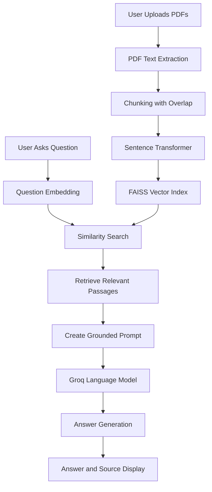

# RAG Chatbot Architecture

```mermaid
flowchart TD
    A[User Uploads PDFs] --> B[PDF Text Extraction]
    B --> C[Chunking with Overlap]
    C --> D[Sentence Transformer]
    D --> E[FAISS Vector Index]

    F[User Asks Question] --> G[Question Embedding]
    G --> H[Similarity Search]
    E --> H

    H --> I[Retrieve Relevant Passages]
    I --> J[Create Grounded Prompt]
    J --> K[Groq Language Model]
    K --> L[Answer Generation]
    L --> M[Answer and Source Display]
```